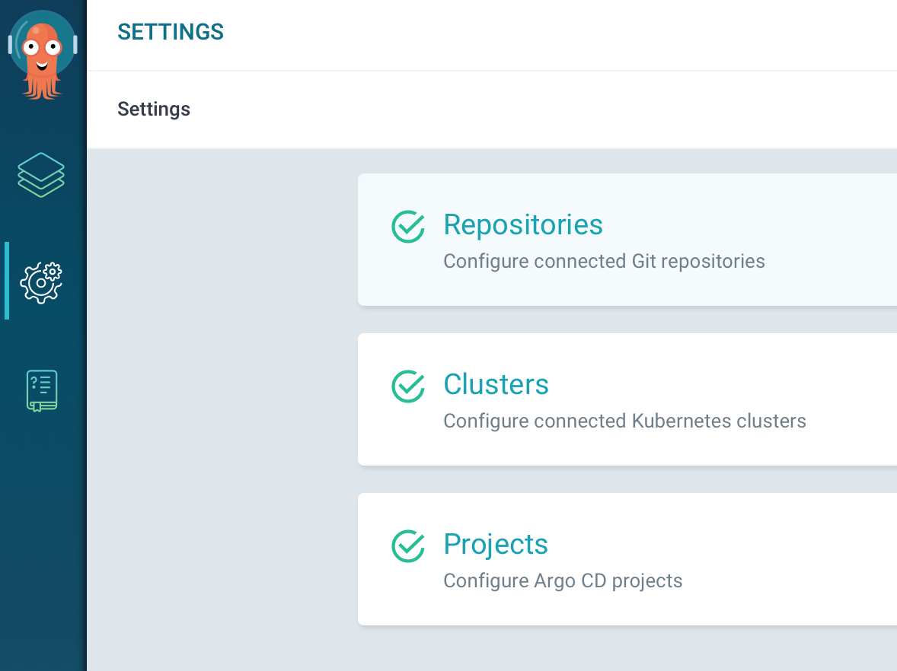
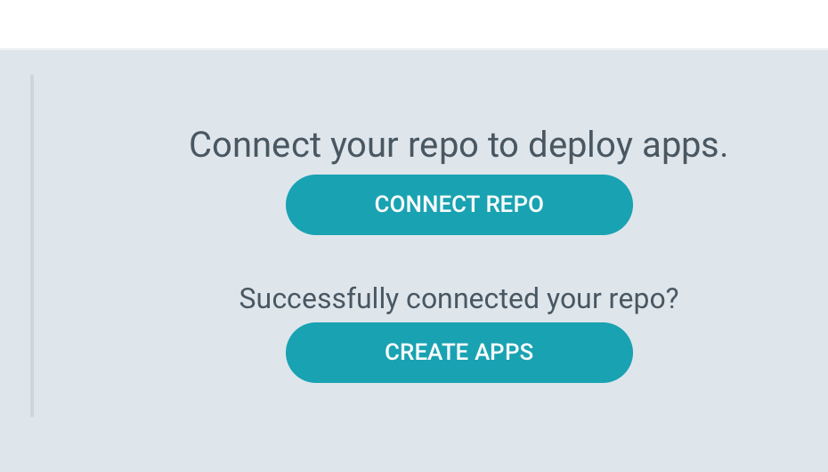
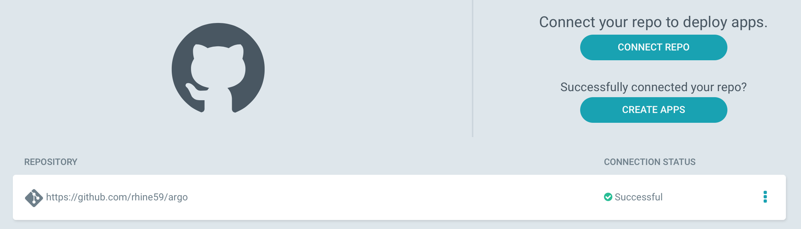
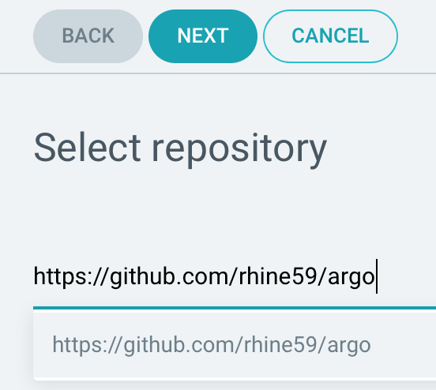
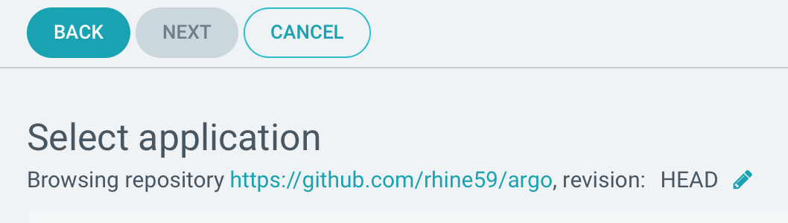
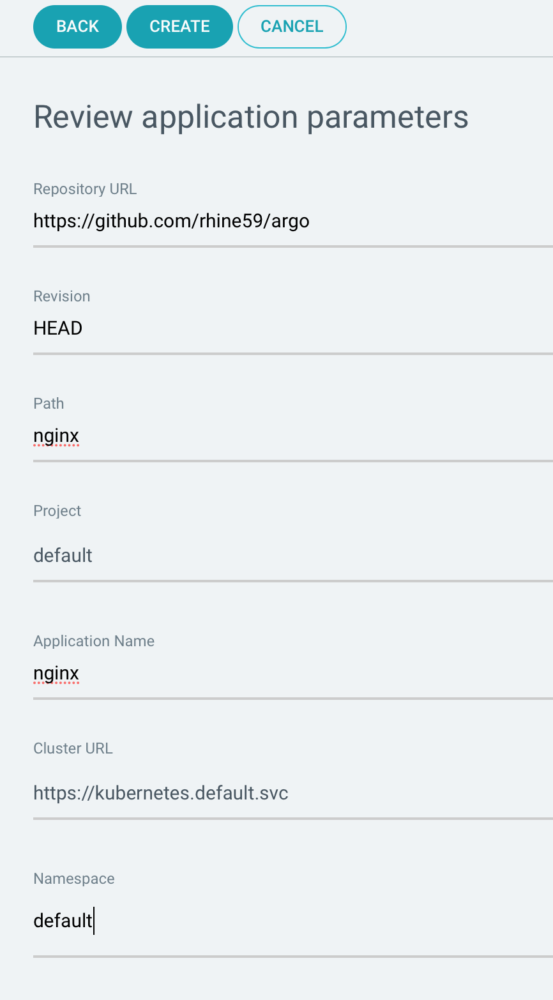
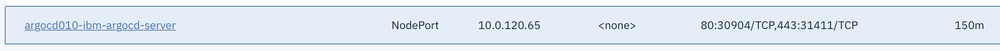
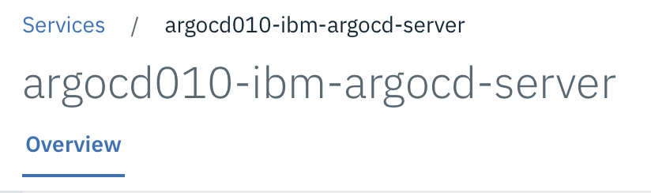
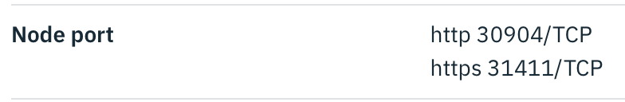
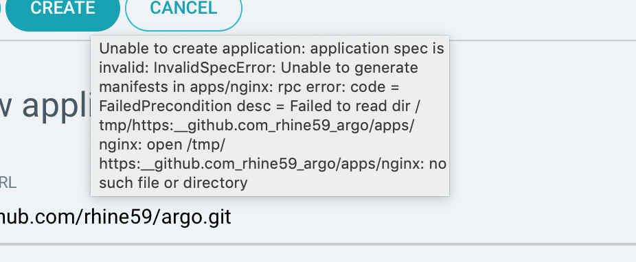

# argo
See [Simplify and Automate Deployments Using GitOps with IBM Multicloud Manager 3.1.2](https://www.ibm.com/cloud/blog/simplify-and-automate-deployments-using-gitops-with-ibm-multicloud-manager-3-1-2)









Download the argo CLI

wget https://169.50.59.138:31411/download/argocd-linux-amd64 --no-check-certificate
--2019-06-28 12:37:58--  https://169.50.59.138:314





```
root@mcm32master:/export/MultiCloudManager/argo# wget https://169.50.59.138:31411/download/argocd-linux-amd64 --no-check-certificate
--2019-06-28 12:37:58--  https://169.50.59.138:31411/download/argocd-linux-amd64
Connecting to 169.50.59.138:31411... connected.
WARNING: cannot verify 169.50.59.138's certificate, issued by ‘O=Argo CD’:
  Self-signed certificate encountered.
    WARNING: certificate common name ‘’ doesn't match requested host name ‘169.50.59.138’.
HTTP request sent, awaiting response... 200 OK
Length: 51780643 (49M) [application/octet-stream]
Saving to: ‘argocd-linux-amd64’

argocd-linux-amd64                           100%[============================================================================================>]  49.38M  29.4MB/s    in 1.7s    

2019-06-28 12:38:00 (29.4 MB/s) - ‘argocd-linux-amd64’ saved [51780643/51780643]
```

```
The Argo CD administration console and CLI can be accessed using the following address:

  export POD_NAME=$(kubectl get pods --namespace services -l "app=argocd010-ibm-argocd,release=argocd010,component=argocd-server" -o jsonpath="{.items[0].metadata.name}")
  kubectl port-forward $POD_NAME --namespace services 8080:8080
  export ARGOCD_ADDR=http://127.0.0.1:8080
  export ARGOCD_CLI_ADDR=127.0.0.1:8080
```

```
The Argo CD CLI can be downloaded directly from the Argo CD server:

Linux:

  wget $ARGOCD_ADDR/download/argocd-linux-amd64
  chmod +x argocd-linux-amd64
  sudo mv argocd-linux-amd64 /usr/local/bin/argocd

macOS:

  wget $ARGOCD_ADDR/download/argocd-darwin-amd64
  chmod +x argocd-darwin-amd64
  sudo mv argocd-darwin-amd64 /usr/local/bin/argocd
```

```
The initial password for the admin user is autogenerated to be the pod name of the Argo CD API server.
It can be retrieved using the following command:

  kubectl get pods --namespace services -l "app=argocd010-ibm-argocd,release=argocd010,component=argocd-server" -o jsonpath="{.items[0].metadata.name}"

Using the above password, login to Argo CD as the admin user, and modify the initial password:

  argocd login $ARGOCD_CLI_ADDR --username admin --password <password>
  argocd account update-password --current-password <password> --new-password <new password>

For further documentation and usage instructions, please visit Argo CD documentation:
https://argoproj.github.io/docs/argo-cd/docs/
```

